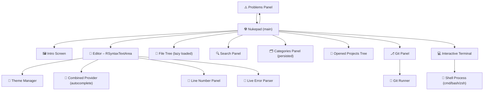

<div align="center">


# ☢︎ Nukepad

**A no-nonsense text editor built from scratch in Java Swing — because it just works.**

[](https://www.java.com)
[](https://docs.oracle.com/javase/tutorial/uiswing/)
[](https://www.formdev.com/flatlaf/)
[](https://github.com/bobbylight/RSyntaxTextArea)
[](https://github.com/alexandru-andoni/Nukepad)
[](./LICENSE)
[](https://github.com/alexandru-andoni)

</div>

---

## <?> What is Nukepad?

Nukepad is an **alpha-stage desktop text editor** written in Java, built on top of the **TEDitor** architecture and progressively expanded with real developer features.

It's not trying to replace your IDE — and it won't, really. It's a passion project with a vision, and it's getting better every version.

```
┌─────────────────────────────────────────────────────┐
│  ☢︎  N U K E P A D  ☢︎                               │
│  ─────────────────────────────────────────────────  │
│  🌳 File Tree  │  📄 Editor Tabs  │  ⎇ Git Panel   │
│  🔍 Search     │  📁 Projects     │  🗂️ Categories  │
│  💻 Terminal   │  ⚠️ Problems     │  🎨 Themes      │
└─────────────────────────────────────────────────────┘
```

---

## ✨ Features

### ✍︎ Editor
| Feature | Details |
|---|---|
| **Tabbed Editing** | Multi-tab editor with scrollable tab bar — open as many files as you need, close them with the ✕ button |
| **Syntax Highlighting** | Powered by RSyntaxTextArea — Java, Python, JavaScript, TypeScript, C, C++, C#, XML, HTML, JSX, TSX, PHP, Go, JSON, React and more |
| **Language Autocomplete** | Context-aware, language-based completions via CombinedProvider; auto-activated after 300ms |
| **Code Folding** | Collapse and expand code blocks right in the editor |
| **Line Numbers** | Custom `LineNumberPanel` for real-time line tracking |
| **Live Error Parsing** | Inline error/warning annotations while you type — detected from compiler output |
| **Anti-Aliased Rendering** | Smooth, crisp text rendering for long editing sessions |

### 🗁 File Management
| Feature | Details |
|---|---|
| **File Tree** | Lazy-loaded file system tree rooted at your home directory with file/folder icons |
| **Opened Projects Panel** | Separate tree view for all currently opened project directories |
| **Project / Folder Opening** | Open entire directories as projects from the menu |
| **New File Templates** | Create new Java, C++, C, Python, JavaScript, and TypeScript files with boilerplate code |
| **Recent Files** | Quick-access to your last 8 opened files/folders |
| **Drag & Drop** | Drop files directly onto the editor, tab bar, or scroll pane to open them |
| **Save / Print** | Save and print the current document |

### 🔍︎ Sidebar & Navigation
| Feature | Details |
|---|---|
| **Categories Panel** | Organize files into custom named groups; persisted across sessions in `~/.nukepad_categories.cfg` |
| **Search Panel** | Full file search starting from your home directory, with a lazy-loaded `BinarySearcher` |
| **Movable Sidebar** | Cycle the sidebar between **Left**, **Center**, and **Right** positions with a single button click |
| **Tabbed Left Panel** | Files · Search · Categories · Opened Projects · Git — all in one clean pane |

### </> Terminal & Compilation
| Feature | Details |
|---|---|
| **Interactive Terminal** | Embedded full shell — `cmd.exe` on Windows, `zsh/bash` on Unix/Mac |
| **Command History** | Navigate previous commands with ↑ / ↓ arrow keys |
| **Problems Panel** | Live table of compiler errors and warnings — with severity icon, message, line number, and file name |
| **Compile Support** | Compile Java (`javac`), C++ (`g++`) and C (`gcc`) from inside the editor |
| **Run Support** | Run Java, Python (`python3`), JavaScript/TypeScript/JSX/TSX (`node`), and compiled C/C++ binaries |
| **Terminal Toggle** | Show/hide the terminal with a dedicated Menu Bar button |

### ⎇ Git Integration
| Feature | Details |
|---|---|
| **Git Panel** | Dedicated sidebar panel showing current branch and changed files (`git status --short`) |
| **Stage All** | Stage all changes with one click (`git add -A`) |
| **Commit** | Commit with a message directly from the panel |
| **Git Menu** | Init · Status · Pull · Push · Log · Diff from the Git menu bar |
| **Branch Management** | Create new branches via `New branch...` dialog |
| **Remote Management** | Add remote origin, set remote URL, push to origin |
| **Context-Aware** | Git commands target the currently active project directory automatically |

### 🖌️ Themes & Appearance
| Feature | Details |
|---|---|
| **Dark Theme** | FlatDarcula with Monokai syntax theme for a rich dark coding experience |
| **Light Theme** | FlatIntelliJ with IntelliJ syntax theme for a clean, bright interface |
| **Theme Persistence** | Your choice is saved to `~/.nukepad_theme.txt` and restored on next launch |
| **Intro Screen** | Animated welcome screen with a chime sound, quick-open buttons, and a theme toggle |

---

## 𖣂 Architecture Overview



---

## 📸 Screenshots


---

## Updates

## v0.1.7 - alpha

- Revamped README.md :
    - Added architecture overview;
    - Revamped the top section;
- Fixed all the remaining problems;

### v0.1.6 - alpha

- This update represents the beginning of the transition towards beta, a huge upcoming chapter for Nukepad.
- The "New" section now allows you to create a variety of files, not just .txt files
- Made the left tabs section movable to the right or center
- Fixed bugs with the git implementation
- Fixed more visual bugs

---

### v0.1.5 – alpha

- Added full **Git integration** — init, status, add, stage, commit, pull, push, log, diff, branch, remote
- Added a **dedicated Git Panel** in the sidebar showing branch and changed files
- Added **interactive terminal** (cmd / bash / zsh) with command history
- Revamped **Autocomplete** — smarter, more accurate completions
- Various interface improvements

---

### v0.1.4 – alpha

- Added **terminal with live error detection** — the Problems panel updates in real time
- **Compiler** now supports Java, C, and C++
- **Run button** now works for Java, Python, JavaScript, TypeScript, C, and C++
- Added a dedicated **Terminal button** in the menu bar to toggle it

---

### v0.1.3 – alpha Patch $02

- Fixed heavy loading via **lazy loading** across FileTree and SearchPanel
- Fixed compiler garbage output and Run button incorrect execution
- Added **drag-and-drop** file support
- Added support for **TypeScript, PHP, Go, JSON, JSX/TSX** files

---

### v0.1.3 – alpha Patch $01

- Replaced the intro chime sound to avoid copyright issues
- Fixed left tab **UI blocking** bug on load
- Added **Opened Projects** tab

---

### v0.1.3 – alpha

- Fixed intro screen delay — chime loads on a **background thread**
- Fixed editor startup delay — FileTree, SearchPanel, and Categories load via **SwingWorker**
- Fixed hardcoded `C:\Users` path in SearchPanel — now uses system home (cross-platform)
- Migrated to **FlatLaf** for a modern look and feel
- Added **dark/light theme switcher** to the View menu and intro screen
- Added **Monokai** (dark) and **IntelliJ** (light) syntax themes
- **Theme persistence** across sessions via `ThemeManager`
- Fixed SearchPanel and IntroScreen colors to respect active theme

---

### v0.1.2 – alpha

- Reorganized the sidebar into **irremovable tabs** on the left
- Added an **intro screen** with chimes and quick-open actions
- Optimized file loading
- Added **Search** functionality
- Added **project opening** via file chooser
- Buttons styled with a glassy UI look
- Added dark/light theme switcher with session persistence

---

### v0.1.0 – alpha

- Updated file tree to **sort folders above files** uniformly
- Added **closable tabs**
- Added **language-based autocomplete** & syntax highlighting (initial language support)
- Changed the placeholder button to an **"Author's Signature"** link to GitHub
- Separated **Compile** and **Run** buttons

---

## ℹ️ Additional Info

- Built on top of the existing **TEDitor** architecture — parts of pre-alpha code are still present.
- Want to contribute? Leave a suggestion in the **Discussions** tab.

---

<div align="center">

Engineered by [@alexandru-andoni](https://gitlab.com/alexandru-andoni)

</div>
